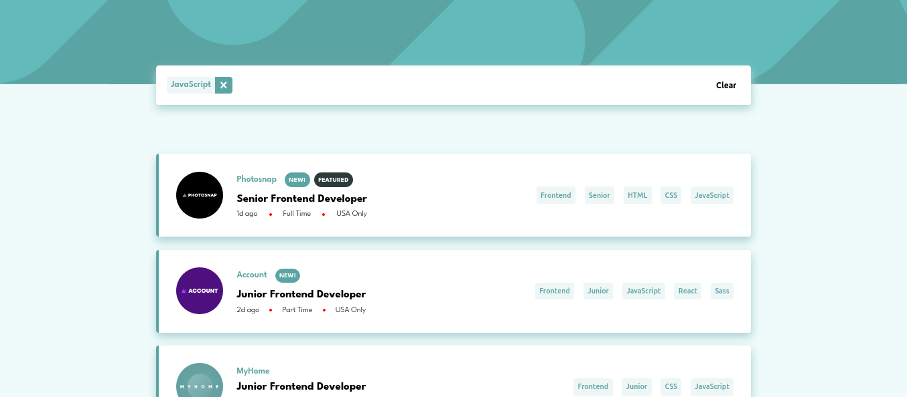

# Frontend Mentor - Job listings with filtering solution

This is a solution to the [Job listings with filtering challenge on Frontend Mentor](https://www.frontendmentor.io/challenges/job-listings-with-filtering-ivstIPCt). Frontend Mentor challenges help you improve your coding skills by building realistic projects.

## Overview

### The challenge

Users should be able to:

- View the optimal layout for the site depending on their device's screen size
- See hover states for all interactive elements on the page
- Filter job listings based on the categories

### Screenshot

### Links

- Solution URL: [Add solution URL here](https://github.com/hex909/job-list)
- Live Site URL: [Add live site URL here](https://hex909job.netlify.app/)

## My process

### Built with

- Semantic HTML5 markup
- SCSS and BEM (for classname)
- Flexbox
- Desktop-first workflow
- Responsive
- [React](https://reactjs.org/) - JS library

### Useful resources

- [W3schools](https://www.w3schools.com/) - This helped me for array methods and some revision for javascript. It is useful when you need fast revision and you stuck the solution is here. i will recommend this site.

## Author

- Frontend Mentor - [@hex909](https://www.frontendmentor.io/profile/hex909)

## How to run

1. Clone this repo.

2. Run `npm i`.

3. Run `npm run dev`.
